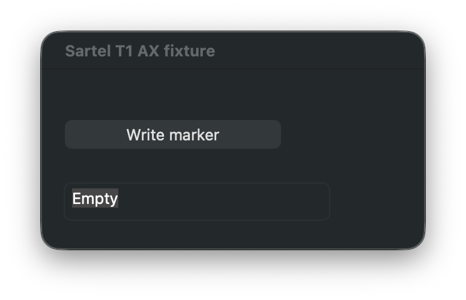
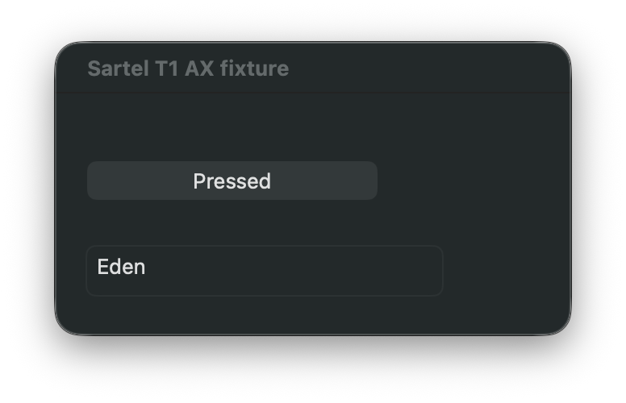

# macOS AX live acceptance evidence

These window-only captures came from the packaged `macos-mcp` 0.4.7 live test
with two disposable AppKit processes. The test used `ObserveAX` to identify a
text field and button, `SetAXValue` to set `Eden`, and `PressAX` to change
`Write marker` to `Pressed`. It also asserted that the second process's marker
was untouched and that cross-process and stale refs were rejected.

Reproduce with `MACOS_MCP_AX_LIVE=1`,
`MACOS_MCP_AX_SERVER=/path/to/installed/macos-mcp`, and
`MACOS_MCP_AX_EVIDENCE_DIR=/path/to/output` when running
`pytest -q tests/test_ax_refs_live.py` on an unlocked Mac with Accessibility
permission. Screen Recording permission is also needed for the optional
captures; AX assertions run without it.
